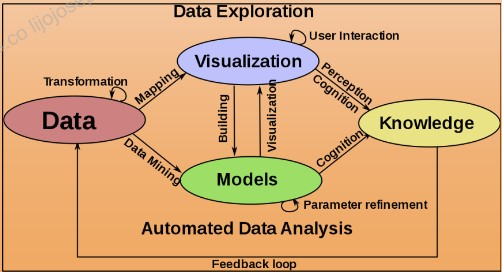

# Tableau Desktop UI
In the main page itself there will be import dataset option. We can import dataset in different formats in Tableau.

## Tableau Data Types
There are mainly 7 data types in Tableau. They are :
- Boolean Values   
  > True or False  
- Date (Date Values)  
  > Aug 16, 2021
- Date and Time  
  >Aug 16, 2021 12:00:00 PM  
- Geographical Values (Geographical Mapping)  
  > India, France  
- Text or String  
  > Welcome to my page.  
- Numerical (Decimal numbers)  
  > 5.000   
- Numerical (Whole numbers)  
  > 5  

## Tableau UI Desktop 
- Toolbar
- Columns and rows shelves 
- Data Pane
- Workspace
- Mark cards
- Canvas 
  
## Dimensions and Measures
A Dimension is a field that is the **Independent Variable** . A measure is a field that is a **Dependent Variable** and it's value is a function of one or more dimension. 
## Show me
Shows all the possible visualization for our data source. 
## Data Visualisation and visual perception 

---------------------------------------------------------
  
## Main Graphs and Application 
**Bar Graph** : Used when dimension is discontinuous  
**Line Graph** : Preffered for continuous dimension  
**Dual Axis Graph** : Used to represent two measures together  
**Geographical Graph** : Used to plot measures on geographical map  
**Area Graph- Dual Axes** : Provides better comparison amongst measures  
**Heat Map** : visualise variations across categories  
**Tree Map** : represent quantities in nested rectangles  
## Joins and Unions 
Join - To combine columns  
Union - To combine rows  
## Sort 
Can be used to sort categories and sub-categories based on their measures. 
## Set 
To set a condition for displaying values.
## Forecasting 
Predict the future trends based on the current values of the graph  
## Highlighting 
Used to highlight specific sub category among all others  
## Device designer 
Make designs for specific devices. 

[Day 3](Day3.md)    
  
[Table of contents](../README.md)