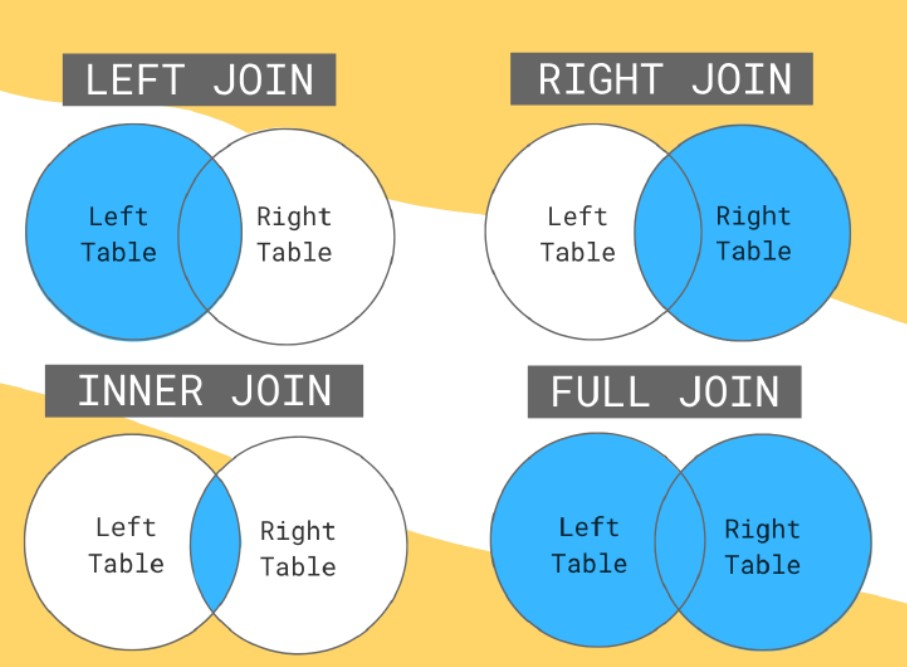

# Visual Analysis  
## Steps
Aquire--------->Filter------------>Enhance---------->Tune---------->Deliver  
## Visual perception  
Attentive & pre-attentive. In attentive we might need more time to understand the data and in preattentive lesser time(due to the visual techniques used). 
## Tableau product family
- Tableau Reader
- Tableau public
- Tableau server
- Tableau online
  
## Joins  
- Inner join 
- left Join
- Right Join 
- Full Join   
    

## Filters
SQL Custom filters  
Context Filters    
Traditional filters  

## Conclusion of Theory part.
With this post we are concluding the theoritical learning of Tableau. More to explore in practical. So from day 4 onwards we will be focusing on doing stuffs. Get ready and thank you for being a part of this series.  
[Day 4](#)    
  
[Table of contents](../README.md)